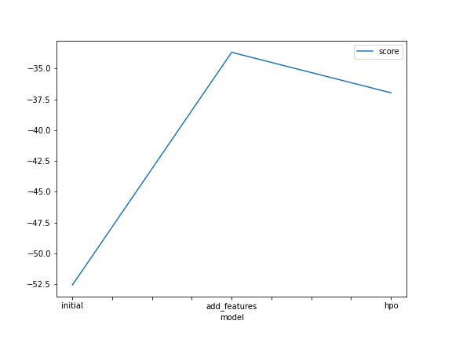
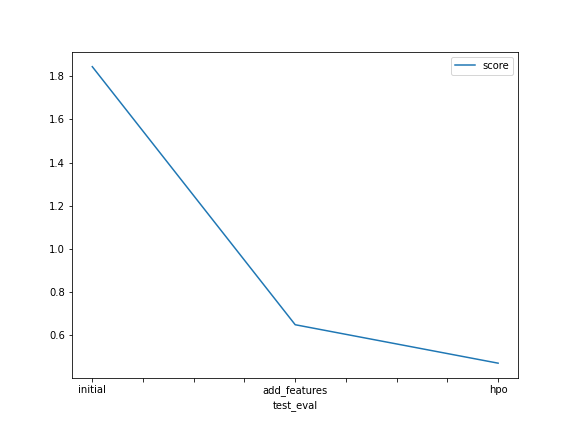

# Report: Predict Bike Sharing Demand with AutoGluon Solution
#### Devika Lakshmanan

## Initial Training
### What did you realize when you tried to submit your predictions? What changes were needed to the output of the predictor to submit your results?
If the predicted count was negative then the prediction was rejected by kaggle for this submission dataset. Hence, all rows for which negative count was predicted, the predicted count was replaced with 0 value.

### What was the top ranked model that performed?
For the initial model, the fit's presets parameter was set to 'best_quality' as per the project instructions to be trained within 10 mins. Also the hyperparameters was left to be the 'default' setting. These settings focused on maximizing the prediction's accuracy and also allowed for bagging and stacking since auto_stack is 'True' with above settings.

It was noticed that in the above scenario, WeightedEnsemble_L3 turned out to be the top ranking model.

## Exploratory data analysis and feature creation
### What did the exploratory analysis find and how did you add additional features?
datetime column was not providing enough data to discover patterns in the bike rent dataset.
It was important to analyse the set based on trends like day of the month, day of the week, hour of the day, month etc.

Hence, datetime column was changed from object datatype to DateTime64 datatype

### How much better did your model preform after adding additional features and why do you think that is?
TODO: Add your explanation

## Hyper parameter tuning
### How much better did your model preform after trying different hyper parameters?
TODO: Add your explanation

### If you were given more time with this dataset, where do you think you would spend more time?
TODO: Add your explanation

### Create a table with the models you ran, the hyperparameters modified, and the kaggle score.
|model|hpo1|hpo2|hpo3|score|
|--|--|--|--|--|
|initial|?|?|?|?|
|add_features|?|?|?|?|
|hpo|?|?|?|?|

### Create a line plot showing the top model score for the three (or more) training runs during the project.

TODO: Replace the image below with your own.

### Create a line plot showing the top kaggle score for the three (or more) prediction submissions during the project.

TODO: Replace the image below with your own.

## Summary
TODO: Add your explanation
